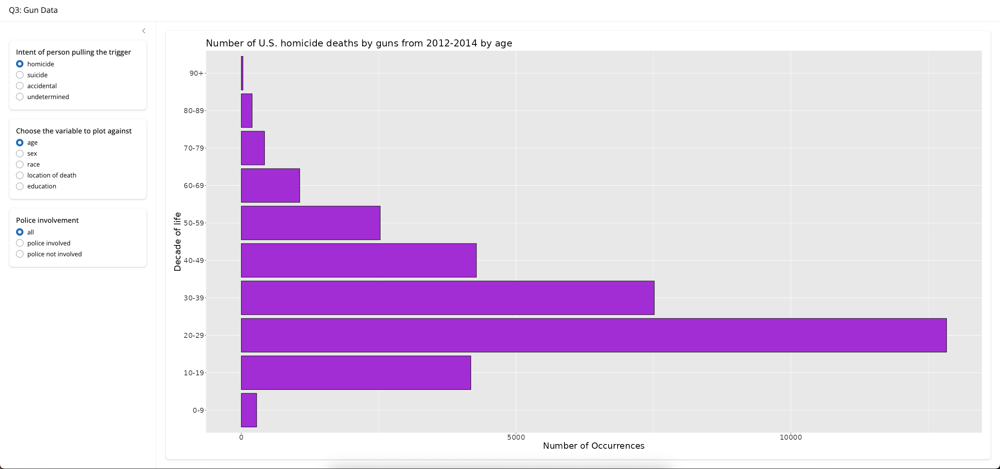

# Shiny-Gun-Data

## Overview

This interactive R Shiny app allows users to explore gun incident data by selecting the intent, a comparison variable (like age, sex, or race), and police involvement status. The application dynamically visualizes the filtered data based on these selections, helping to reveal patterns and relationships within the dataset.

 ## Link to App

 
 <a target="_blank" rel="noopener noreferrer" href="https://g-whittington.shinyapps.io/Question3/">Check it out here</a>

 ## App Preview

 